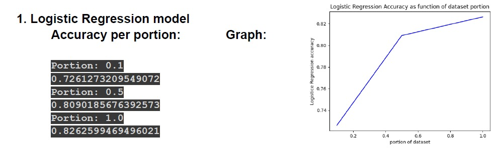
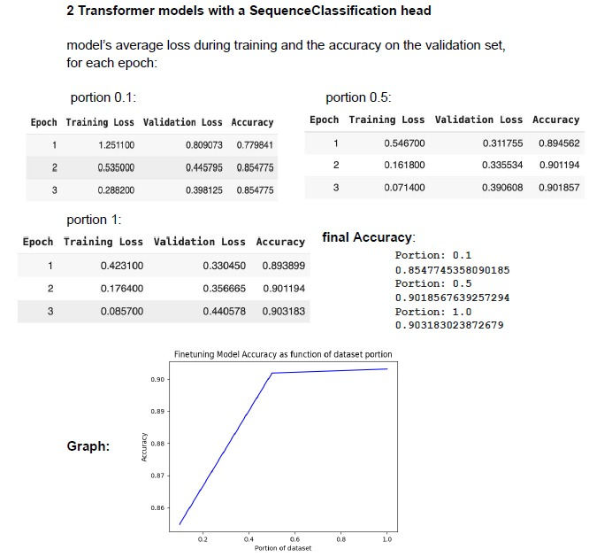
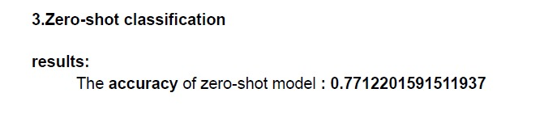

# Text Classification Using Different Approaches

This repository contains code for performing text classification using various techniques like logistic regression, transformer fine-tuning, and zero-shot classification. 
The goal is to compare the performance of these approaches on different portions of the dataset.

## Usage
- linear_classification(portion): Perform linear classification using logistic regression.
- transformer_classification(portion): Perform transformer fine-tuning for text classification.
- zeroshot_classification(portion): Perform zero-shot classification using pre-trained models.
- You can adjust the portion of the dataset used for training and evaluation by passing different values to the functions mentioned above.

## Results
The code generates plots to visualize the accuracy of different classification methods as a function of the dataset portion used:

## Dependencies
- Python 3.x
- NumPy
- Matplotlib
- Scikit-learn
- Transformers
- Contributing
- Contributions are welcome! If you have suggestions or improvements, feel free to open an issue or create a pull request.

## License
This project is licensed under the MIT License - see the LICENSE file for details.
